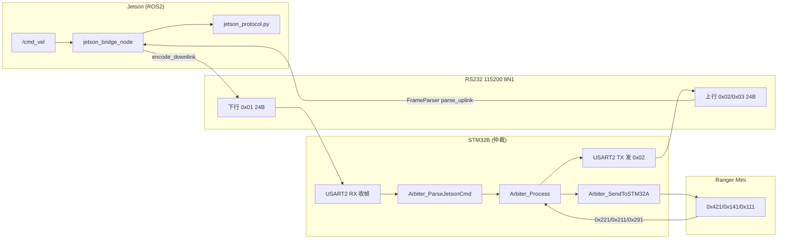

# 机器人通信文档

| 文件 | 说明 |
|------|------|
| [PROTOCOL_V3.md](./PROTOCOL_V3.md) | **唯一权威协议**（Jetson ↔ STM32B ↔ STM32A） |

实现顺序：**先按 PROTOCOL_V3 定稿 → 再改 B 固件与 ROS 包**。  
Legacy 仅见协议附录 A，不得与新 V3 混用。

**Jetson ROS2（`ds_jetson_bridge` v0.2）：** 24B 下行 + 解析 `0x02` 上行，话题前缀 `stm32b/`。

**STM32B 固件对照：** [STM32B_FIRMWARE_NOTES.md](./STM32B_FIRMWARE_NOTES.md)

---

## Jetson ↔ STM32B RS232 数据流（接收 / 解析 / 控制）

本节描述 **V3 协议** 在 Jetson 与 STM32B 之间的完整链路。帧格式细节见 [PROTOCOL_V3.md](./PROTOCOL_V3.md)；B 板固件实现见 [STM32B_FIRMWARE_NOTES.md](./STM32B_FIRMWARE_NOTES.md)。

### 系统总览

```text
  ROS2 /cmd_vel                    UART V3 24B              CAN 500K
  teleop / 规划  ──►  jetson_bridge  ◄──►  STM32B  ◄──►  Ranger(STM32A)
                         │                  │
                    Prolific USB         USART2 PA2/3
                    /dev/ttyUSB5         (Jetson 专用)
                         │
                    勿接 USART1 PA9/10（那是 [DS]/[BOOT] 调试文本口）
```



### 物理层与接线（必核对）

| 项目 | 配置 |
|------|------|
| 电气 | USB 转 RS232/TTL（现场多为 **Prolific**） |
| 波特率 | **115200**，8 数据位，无校验，1 停止位（8N1） |
| 字节序 | 多字节字段 **大端（BE）** |
| Jetson 设备 | `/dev/serial/by-id/usb-Prolific_...-port0` → 通常 `ttyUSB5` |
| STM32B Jetson 口 | **USART2**：`PA2=TX`，`PA3=RX`（代码里历史命名可能写 USART3） |
| STM32B 调试口 | **USART1** `PA9/PA10`：只打 `[DS]`、`[BOOT]` 等**文本**，不是 V3 二进制 |

**正确交叉接线：**

```text
Jetson USB-TTL TX  ──►  STM32 PA3 (USART2_RX)
Jetson USB-TTL RX  ◄──  STM32 PA2 (USART2_TX)
GND                ───  GND
```

接反时常见现象：**probe 能收到 `0x02`，但 B 板永远没有 `[JETSON CMD]`，bridge 刷 `Waiting for 0x02` 或只有 TX 无 RX**。

### V3 帧外壳（双方共用，固定 24 字节）

| 偏移 | 字段 | 说明 |
|------|------|------|
| 0 | `0xAA` | 帧头 |
| 1 | `frame_type` | `0x01` 下行，`0x02` 状态上行，`0x03` 扩展上行 |
| 2 | `seq` | 0~255 循环；**每发一帧 +1**（含零速心跳） |
| 3~22 | payload | 见下表 |
| 23 | `xor` | Byte0~Byte22 逐字节异或 |

**合法帧条件：** `header==0xAA`、类型合法、`xor` 校验通过、长度恰好 24。

---

### Jetson 侧：接收 / 解析 / 控制

实现文件：`jetson_bridge_node.py` + `jetson_protocol.py`。

#### 1. 控制输入（ROS → 待发指令）

```text
/cmd_vel (geometry_msgs/Twist)
  linear.x, linear.y, angular.z
       │
       ▼
_cmd_vel_cb()
  · cruise_scale 缩放
  · max_linear / max_angular 限幅
       │
       ▼
twist_to_motion()  →  pending: v_mm_s, omega, steer, motion_model
```

| 输入场景 | `motion_model` | 下发要点 |
|----------|----------------|----------|
| `i` 前进 | 0 ACKERMANN | `v` + `omega` |
| `i`+`j` 弧线 | 0 ACKERMANN | `v` + `omega` |
| 单独 `j`/`l`（默认） | 1 SIDEWAYS | `v` + `steer=±1571`，`omega=0` |
| 单独 `j`/`l`（`strafe_jl:=false`） | 2 SPIN | `omega`，`v=0` |

结果缓存在 `_pending_*`，**不立刻发串口**；由 50Hz 定时器统一组帧。

#### 2. 定时下发（50Hz `_tick`）

```text
_tick() 每 20ms
  ├─ _ensure_serial()          断线则 auto_reconnect
  ├─ _build_downlink()         安全逻辑 → DownlinkCommand
  │    ├─ cmd_timeout 超时 → v/ω/steer=0（seq 仍递增）
  │    ├─ 运动后断令 → RECOVER 1s 零速（RECOVER_STABLE_MS=1000）
  │    └─ bridge= RUN / IDLE / RECOVER
  ├─ encode_downlink()         24B，type=0x01，计算 xor
  ├─ serial.write(24B)         → STM32 USART2_RX
  └─ _poll_uplink()             读串口 → 解析上行
```

**下行 payload（`0x01`）关键字段：**

| 偏移 | 字段 | Jetson 填入 |
|------|------|-------------|
| 3 | `mode_req` | 上电前 50 帧固定 `1`（CAN）；之后用 `mode_req` 参数 |
| 4~5 | `v_cmd` | mm/s，s16 BE |
| 6~7 | `omega_cmd` | 0.001 rad/s，s16 BE |
| 8~9 | `steer_cmd` | 0.001 rad；横移 ±1571 |
| 10 | `motion_model` | 0/1/2/3 |

#### 3. 上行接收与解析

```text
serial.read() 原始字节流
       │
       ▼
FrameParser.feed()
  · 在缓冲区找 0xAA
  · 认 type ∈ {0x01,0x02,0x03}
  · 凑满 24B 且 xor 正确 → yield frame
       │
       ▼
parse_uplink_status()   （仅处理 type=0x02）
  · safety_state, limit_factor, link_state
  · v_actual, omega_actual, steer_actual
  · sonar_front/back/left/right, battery
       │
       ▼
_publish_status()  →  stm32b/* 话题 + stm32b/status 中文摘要
```

**上行 `0x02` payload 要点：**

| 偏移 | 字段 | 发布到 ROS |
|------|------|------------|
| 3 | `safety_state` | `stm32b/safety_state`（1~4） |
| 4 | `link_state` | `stm32b/link_state`（bit0=Jetson 心跳） |
| 5 | `limit_factor` | `stm32b/limit_factor`（0~100%） |
| 6~7 | `v_actual` | `stm32b/motion_actual.linear.x` |
| 8~9 | `omega_actual` | `stm32b/motion_actual.angular.z` |
| 12~19 | 四向超声 mm | `stm32b/sonar_mm` |

**告警逻辑：**

- 开机后 `_last_uplink_time==0` 且已发 TX 数秒 → `Waiting for STM32B 0x02 uplink`
- 曾有上行但 **300ms** 无新 `0x02` → `No valid 0x02 uplink`
- USB 热插拔 → flush 脏数据 → prime 15 帧下行 → 读 0.6s 窗口等 `0x02`

#### 4. Jetson 侧时序参数

| 参数 | 典型值 | 含义 |
|------|--------|------|
| `rate_hz` | 50 | 下行周期 20ms |
| `cmd_timeout_ms` | 500~2000 | 无 `/cmd_vel` 后发零速 |
| `RECOVER_STABLE_MS` | 1000 | 运动中断指令后强制 1s 零速 |
| `UPLINK_TIMEOUT_MS` | 300 | 无有效上行告警 |
| B 侧心跳判定 | 300ms | `seq` 未更新 → `link_state.bit0=1` |

---

### STM32B 侧：接收 / 解析 / 控制

实现位置：B 板固件 `arbiter.c` + `usart`（**硬件 USART2**）。主循环约 **20ms**。

#### 1. 下行接收（Jetson → B）

```text
USART2 中断/轮询收字节
       │
       ▼
USART_GetJetsonFrame() / 帧同步
  · 找 0xAA，type=0x01，24B，xor OK
       │
       ▼
Arbiter_ParseJetsonCmd()
  · 解析 v, omega, steer, motion_model, mode_req, seq
  · seq 变化 → 刷新 Jetson 心跳计时（300ms 窗口）
  · motion_model 变化 → Arbiter_SetMotionMode() → CAN 0x141
  · 调试口打印 [JETSON CMD] v=... steer=... motion=...
       │
       ▼
写入 arb_state.jetson_cmd
```

**无 `[JETSON CMD]` 的常见原因：** USB 未接到 PA2/PA3、TX/RX 未交叉、波特率不一致、xor/帧长与 Jetson 不一致。

#### 2. 仲裁与本地传感（B 内部）

```text
Arbiter_SetObstacleDistances()   ← USART3 超声 IF1~4
Arbiter_ProcessCANFeedback()     ← 收 0x221/0x211/0x291/0x361 ...
       │
       ▼
Arbiter_Process()
  · NORMAL：透传 jetson v/ω/steer（须已修 P0：steering 不强制置 0）
  · SPEED_LIMIT：按 limit_factor 缩放 v
  · DEGRADED：本地避障策略，常覆盖 Jetson（心跳丢失或超声异常）
  · EMERGENCY：强制 v=0, ω=0
       │
       ▼
arb_state.output（仲裁后输出）
```

| `safety_state` | B 行为（简述） |
|----------------|----------------|
| 1 NORMAL | 透传 Jetson 指令到 CAN |
| 2 SPEED_LIMIT | 按比例限速 |
| 3 DEGRADED | 本地策略，不听 Jetson |
| 4 EMERGENCY | 强制停车 |

#### 3. 下发底盘（B → Ranger CAN）

```text
Arbiter_SendToSTM32A()  约 20ms
  ├─ mode_req=1 时发 0x421 = 0x01（CAN 指令模式）
  ├─ motion_model 变化发 0x141（0 阿克曼 / 1 斜移 / 2 自旋）
  ├─ 0x291.switching==1 或 0x211==遥控(0x03) → 仅发零速 0x111
  └─ 否则周期发 0x111：v(mm/s), omega, steer(0.001rad)
```

**横移 `j`/`l` 时 CAN 期望：**

| CAN ID | 内容 |
|--------|------|
| `0x141` | `0x01` 斜移 |
| `0x111` | `v≈300`，`steer=±1571`，`omega=0` |

调试口应出现：`[CMDOUT] v=300 steer=1571 ... mode=NORMAL`。

#### 4. 上行组帧（B → Jetson）

```text
USART_SendV3StatusFrame()   type=0x02, 20ms
  · safety_state, limit_factor, link_state
  · 来自 0x221 的 v/ω/steer
  · 四向超声 mm、电池电压/SOC

USART_SendV3DetailFrame()   type=0x03, 与 0x02 交替（可选）
  · 0x281 轮速、0x271 转角等
       │
       ▼
USART2 TX (PA2) → Jetson USB-RX
```

**注意：** `0x02` 上行与是否收到 Jetson 下行**无关**；只要 B 固件主循环在跑，PA2 上应持续有二进制帧（约 20Hz）。Jetson `probe_tty` 可独立验证。

#### 5. STM32B 主循环顺序（检查清单）

```c
/* 每 20ms */
if (USART_GetJetsonFrame(buf))
    Arbiter_ParseJetsonCmd(buf, 24);      /* ① 收 Jetson */

Arbiter_SetObstacleDistances(...);        /* ② 超声 */
Arbiter_ProcessCANFeedback();             /* ③ CAN 回馈 */
Arbiter_Process();                        /* ④ 仲裁 */
Arbiter_SendToSTM32A();                   /* ⑤ 发底盘 */

USART_SendV3StatusFrame(...);             /* ⑥ 上行 0x02 */
USART_SendV3DetailFrame(...);             /* ⑦ 上行 0x03（可选） */
```

缺 ① 则无 `[JETSON CMD]`；缺 ⑥ 则 Jetson 永远 `Waiting for 0x02`。

---

### 端到端控制示例（按住 `i` 前进）

```text
1. teleop 发 /cmd_vel: linear.x=0.2
2. Jetson twist_to_motion → v_cmd=200, motion=ACKERMANN
3. Jetson TX: AA 01 seq .. v=200 .. xor
4. STM32 Parse → [JETSON CMD] v=200 motion=0
5. 仲裁 NORMAL → [CMDOUT] v=200
6. CAN 0x111 → Ranger 前进
7. CAN 0x221 回馈 v_actual≈197
8. STM32 组 0x02 → safety=1, v_actual=197, sonar=...
9. Jetson RX: 仲裁=NORMAL 底盘实际v=197mm/s
10. ROS stm32b/motion_actual.linear.x ≈ 0.197
```

### 联调判据（一眼区分问题在哪一段）

| Jetson 日志 | STM32 调试口 | 结论 |
|-------------|--------------|------|
| 只有 TX，无 RX | 无 `[JETSON CMD]` | **下行没到 USART2**（接线/port） |
| 只有 TX，无 RX | 有 `[JETSON CMD]` | **上行 PA2→Jetson 不通** 或 bridge 占口异常 |
| TX+RX 正常 | 有 CMD，无 CMDOUT | 仲裁 DEGRADED/EMERGENCY 或 CAN 未通 |
| TX `SIDEWAYS` | CMDOUT steer=±1571 | Jetson+B 串口正常；车不动查 0x291/遥控/急停 |
| `bridge=RUN` v=200 | `limit=0%` | 超声太近，B 限速为 0 |

独立验证串口（**先停 bridge**）：

```bash
ros2 run ds_jetson_bridge probe_tty -- --time 5
# ttyUSB5 uplink 0x02 应 >> 0
```

---

## 代码与文件（`ds_jetson_bridge`）

| 路径 | 作用 |
|------|------|
| `src/ds_jetson_bridge/ds_jetson_bridge/jetson_bridge_node.py` | ROS 节点：串口收发、重连、`/cmd_vel` → 24B 下行 |
| `src/ds_jetson_bridge/ds_jetson_bridge/jetson_protocol.py` | V3 协议：组帧/解帧、`twist_to_motion()`、中文 status 字符串 |
| `src/ds_jetson_bridge/launch/jetson_bridge.launch.py` | launch 默认参数（**优先于**节点内置默认） |
| `src/ds_jetson_bridge/ds_jetson_bridge/probe_tty.py` | 独立探测：哪路 tty 有 0x02 上行 |
| `docs/PROTOCOL_V3.md` | 24B 帧格式权威说明 |

### 主流程（`jetson_bridge_node.py`）

完整 RS232 收发/解析/控制见上文 **「Jetson ↔ STM32B RS232 数据流」**。节点内简图：

```text
main()
  └─ JetsonBridgeNode.__init__     打开串口、订阅 /cmd_vel、50Hz 定时器
       ├─ _cmd_vel_cb()            Twist → pending v/ω/steer（jetson_protocol.twist_to_motion）
       └─ _tick() 每 20ms
            ├─ _ensure_serial()    断线重连 / _on_serial_restored() flush+prime+读上行
            ├─ _build_downlink()   RUN/IDLE/RECOVER 安全逻辑 → encode_downlink()
            ├─ _ser.write(24B)     下发 STM32B
            └─ _poll_uplink()       FrameParser → parse_uplink_status → 发布 stm32b/*
```

### ROS 话题

| 话题 | 类型 | 方向 | 说明 |
|------|------|------|------|
| `/cmd_vel` | `geometry_msgs/Twist` | 订阅 | 速度指令输入 |
| `stm32b/status` | `std_msgs/String` | 发布 | **中文可读** 一行状态（推荐监视） |
| `stm32b/safety_state` | `std_msgs/UInt8` | 发布 | 1~4 仲裁状态 |
| `stm32b/limit_factor` | `std_msgs/UInt8` | 发布 | 0~100 限速 % |
| `stm32b/link_state` | `std_msgs/UInt8` | 发布 | bit0=Jetson 心跳，bit1=CAN |
| `stm32b/motion_actual` | `geometry_msgs/Twist` | 发布 | 底盘实际 v/ω |
| `stm32b/sonar_mm` | `std_msgs/UInt16MultiArray` | 发布 | [前,后,左,右] mm |
| `stm32b/battery_voltage` | `std_msgs/Float32` | 发布 | 电压 V |
| `stm32b/battery_soc` | `std_msgs/UInt8` | 发布 | 电量 % |
| `stm32b/uplink_seq` | `std_msgs/UInt8` | 发布 | B 板上行帧序号 |

---

## ROS 参数一览

**说明：** 用 `ros2 launch ...` 时以 **launch 默认值**为准；直接 `ros2 run ds_jetson_bridge jetson_bridge` 时用 **节点 `declare_parameter` 默认值**。

### launch 可配（`jetson_bridge.launch.py`）

| 参数 | launch 默认 | 节点默认（未走 launch 时） | 含义 |
|------|-------------|---------------------------|------|
| `cmd_port` | `/dev/ttyUSB5` | 同左 | 串口设备，**建议 by-id** |
| `cmd_baud` | `115200` | 同左 | 波特率 |
| `rate_hz` | `50.0` | 同左 | 下行周期 Hz（50Hz=20ms） |
| `cmd_timeout_ms` | `500` | `200` | 无 `/cmd_vel` 超过此值 → 零速 |
| `cruise_scale` | `1.0` | `0.7` | `/cmd_vel` 缩放系数 |
| `max_linear_m_s` | `0.8` | 同左 | 线速度上限 m/s |
| `max_angular_rad_s` | `1.0` | 同左 | 角速度上限 rad/s |
| `mode_req` | `1` | `1` (MODE_CAN) | 下行 mode_req：0待机 1CAN 2遥控 |
| `strafe_jl_from_angular` | `true` | 同左 | `j`/`l`→横移；`false`→自旋 |
| `strafe_speed_m_s` | `0.3` | 同左 | 横移线速度 m/s |
| `sideways_steer_millirad` | `1571` | 同左 | 横移目标转角 ≈90° |
| `auto_reconnect` | `true` | 同左 | USB 断线自动重连 |
| `reconnect_interval_s` | `1.0` | 同左 | 设备消失时重试 open 间隔 |
| `reconnect_settle_s` | `0.15` | 同左 | close/open 稳定等待 |
| `reconnect_uplink_deadline_s` | `2.0` | 同左 | reopen 后无 0x02 → hard reconnect |

### 仅节点代码（launch 未暴露，需 `--ros-args -p`）

| 参数 | 默认 | 代码位置 | 含义 |
|------|------|----------|------|
| `motion_model` | `0` | `jetson_bridge_node.py` | 默认运动模型（通常由 twist 映射覆盖） |
| `mode_hold_frames` | `50` | 同左 | 上电前 N 帧强制 `mode_req=CAN` |
| `log_tx` | `true` | 同左 | 每秒打印 TX/RX 摘要 |

未在 launch 里的参数示例：

```bash
ros2 run ds_jetson_bridge jetson_bridge --ros-args \
  -p cmd_port:=/dev/serial/by-id/usb-Prolific_Technology_Inc._USB-Serial_Controller-if00-port0 \
  -p log_tx:=false \
  -p mode_hold_frames:=100
```

### 协议常量（`jetson_protocol.py`，一般不改）

| 常量 | 值 | 含义 |
|------|-----|------|
| `FRAME_HEADER` | `0xAA` | 帧头 |
| `FRAME_LEN` | `24` | 帧长 |
| `FRAME_TYPE_DOWN` / `UP_STATUS` | `0x01` / `0x02` | 下行 / 上行状态 |
| `MAX_V_MM_S` | `2000` | 线速度上限 mm/s |
| `MAX_OMEGA_MILLIRAD_S` | `3259` | 角速度上限 0.001 rad/s |
| `MAX_STEER_SIDEWAYS_MILLIRAD` | `1571` | 横移 ≈90° |
| `RECOVER_STABLE_MS` | `1000` | 运动中断指令后强制零速 1s（代码写死） |
| `CMD_TIMEOUT_MS` | `200` | 节点默认 cmd 超时（launch 可覆盖） |
| `UPLINK_TIMEOUT_MS` | `300` | 无有效上行告警阈值 |

### `/cmd_vel` → 24B 下行映射（`twist_to_motion()`）

| 键盘/ Twist | `motion_model` | 下发字段 |
|-------------|----------------|----------|
| `i` 前进 `linear.x` | `0` ACKERMANN | `v` + `omega` |
| `i`+`j` 弧线 | `0` ACKERMANN | `v` + `omega` |
| 单独 `j`/`l`（默认） | `1` SIDEWAYS | `v` + `steer=±1571` |
| 单独 `j`/`l`（`strafe_jl:=false`） | `2` SPIN | `omega` |

### 安全逻辑 `_build_downlink()`（`bridge=` 日志）

| 条件 | `bridge=` | 下发 |
|------|-----------|------|
| 有效 `/cmd_vel` 且未超时 | `RUN` | pending 非零速度 |
| 无指令或 pending=0 | `IDLE` | `v=0` |
| 刚运动过且 `cmd_timeout` 超时 | `RECOVER` | 连续 1s `v=0`（`RECOVER_STABLE_MS`） |

---

## 编译（改代码后执行一次）

```bash
cd ~/catkin_ws
source /opt/ros/humble/setup.bash
colcon build --packages-select ds_jetson_bridge --symlink-install
source ~/catkin_ws/install/setup.bash
```

---

## 串口打不开（`OSError: [Errno 5] Input/output error`）

`jetson_bridge` 默认使用 **Prolific** 对应的 STM32B 口（`/dev/ttyUSB5` 或 by-id 下的 `usb-Prolific_...-port0`）。**不要用 Quectel 模组的 ttyUSB0~4。**

```bash
ls -l /dev/serial/by-id/
# 应看到 usb-Prolific_Technology_Inc._USB-Serial_Controller-... -> ttyUSB5
```

若 launch 报 **Errno 5**，内核日志里常有 `pl2303 ... failed: -32`，表示 USB 转串口芯片无响应：

1. **拔掉** Jetson 连 STM32B 的那根 USB，等 3～5 秒，**再插上**。
2. 确认无其它程序占用：`fuser -v /dev/ttyUSB5`（有输出则先 `pkill` 对应进程）。
3. 用稳定设备名启动：

```bash
ros2 launch ds_jetson_bridge jetson_bridge.launch.py \
  cmd_port:=/dev/serial/by-id/usb-Prolific_Technology_Inc._USB-Serial_Controller-if00-port0
```

4. 仍失败：换 USB 口/线，或在 B 板复位后再试。

### USB 热插拔（运行中拔线再插上）

`jetson_bridge` 已带 **自动重连**（启动日志里应有 `serial reconnect=on`）。流程：

```text
Serial I/O lost ... Errno 5          ← 拔线
Serial open failed ... Errno 2       ← 设备消失，正常
Serial restored ... try 1 ...        ← 插回，flush 脏数据 + 发下行 + 读上行
Hard serial reconnect ...            ← 仍无有效 0x02 时自动再开一次口（约 0.15s 后）
Serial restored ... 0x02 uplink OK   ← 恢复成功
RX 上行 ...
```

**注意：** 不要看到 `process has died`；若反复失败，**复位 STM32B** 或 **Ctrl+C 重启 bridge** 比一直挂着更可靠。

重连相关参数见上文 **「ROS 参数一览 → launch 可配」**；实现函数：`_open_serial`、`_bringup_serial_link`、`_hard_reconnect`（均在 `jetson_bridge_node.py`）。

更快重连（可选）：

```bash
ros2 launch ds_jetson_bridge jetson_bridge.launch.py \
  cmd_port:=/dev/serial/by-id/usb-Prolific_Technology_Inc._USB-Serial_Controller-if00-port0 \
  reconnect_uplink_deadline_s:=1.0
```

独立验证串口（**bridge 需先 Ctrl+C 停掉**，避免占口）：

```bash
ros2 run ds_jetson_bridge probe_tty -- --time 5
# 应看到 uplink 0x02 > 0
```

---

## 停止后台节点（联调前先清场）

ROS 节点用 `Ctrl+C` 结束后，有时子进程仍在。在任意终端执行：

```bash
# 结束本项目的桥接、键盘遥控、topic pub 等
pkill -f "jetson_bridge" 2>/dev/null
pkill -f "teleop_twist_keyboard" 2>/dev/null
pkill -f "ros2 topic pub" 2>/dev/null
pkill -f "ds_serial_monitor" 2>/dev/null

# 确认已干净（应无输出或只剩 bash）
source /opt/ros/humble/setup.bash
source ~/catkin_ws/install/setup.bash
ros2 node list
```

说明：没有单独的「删除 topic」命令；**节点退出后 `/cmd_vel` 等 topic 会自动消失**。若 `ros2 node list` 仍有个别残留，对该终端再 `Ctrl+C`，或 `kill -9 <pid>`（`pgrep -af teleop` 查 pid）。

---

## Jetson 联调（三终端）

**不要同时**开「方式 A topic pub」和「方式 B 键盘」，二者都会发 `/cmd_vel`，会互相抢。

每个终端先执行：

```bash
source ~/catkin_ws/install/setup.bash
```

### 终端 1 — 桥接（先开，保持运行）

**推荐（稳定 by-id 口 + 键盘松手 2s 才清零 + 自动重连）：**

```bash
ros2 launch ds_jetson_bridge jetson_bridge.launch.py \
  cmd_port:=/dev/serial/by-id/usb-Prolific_Technology_Inc._USB-Serial_Controller-if00-port0 \
  cmd_timeout_ms:=2000
```

仅默认值（`cruise_scale=1.0`：`linear.x: 0.2` → 下发 **200 mm/s**）：

```bash
ros2 launch ds_jetson_bridge jetson_bridge.launch.py
```

launch 已暴露的参数见 **「ROS 参数一览」**。常用 override 示例：

```bash
# 横移更慢
ros2 launch ds_jetson_bridge jetson_bridge.launch.py strafe_speed_m_s:=0.15

# j/l 改原地自旋
ros2 launch ds_jetson_bridge jetson_bridge.launch.py \
  strafe_jl_from_angular:=false max_angular_rad_s:=0.3
```

**`j` / `l` 横移太慢：** `strafe_speed_m_s:=0.15`

**`j` / `l` 改回原地旋转：** `strafe_jl_from_angular:=false max_angular_rad_s:=0.3`

### 终端 2 — 速度指令（二选一）

**方式 A — 持续前进（推荐联调）：**

```bash
ros2 topic pub /cmd_vel geometry_msgs/msg/Twist \
  "{linear: {x: 0.2}, angular: {z: 0.0}}" -r 20
```

**方式 B — 键盘遥控：**

```bash
# 未安装时：
sudo apt install -y ros-humble-teleop-twist-keyboard

ros2 run teleop_twist_keyboard teleop_twist_keyboard
```

| 键 | 作用 |
|----|------|
| `i` | 前进（须**长按**，不是点一下） |
| `,` | 后退 |
| `j` / `l` | **横移**左 / 右（斜移，车头朝向不变；bridge 默认 `strafe_jl_from_angular:=true`） |
| `i`+`j` / `i`+`l` | 前进中弧线左转 / 右转（阿克曼） |
| `k` | 停止 |
| `q` / `z` | 加 / 减 最大速度 |

键盘窗口必须有焦点。松手超过 `cmd_timeout_ms` 后，bridge 会先进入 **1 秒零速**（日志 `bridge=RECOVER`，见下文）。

横移对应 Ranger 手册 **斜移模式**（`0x141=0x01`，转角约 ±90°）。单独 `j`/`l` 时 TX 日志应出现 `motion=SIDEWAYS steer=±1571`。

**确认键盘在发（可选，第四个终端）：**

```bash
ros2 topic hz /cmd_vel
# 按住 i 时应约 10 Hz；松手后为 0
```

### 终端 3 — 状态监视

**推荐（中文可读，一条看完）：**

```bash
ros2 topic echo /stm32b/status
```

示例输出（正常）：

```text
data: Jetson串口=已连接 仲裁=限速避障(SPEED_LIMIT) 限速=0% B板报告Jetson心跳=正常 ...
```

拔线后应变为：

```text
data: Jetson串口=断开 USB未连接或重连中 请插回线缆并等3~5秒 (无STM32B实时数据)
```

重连后若只有 TX、无 RX：

```text
data: Jetson串口=已连接 STM32B上行=无 已发TX等待0x02 若超过5秒仍无RX请复位B板或重插USB
```

原始数字话题（给程序用）：

```bash
ros2 topic echo /stm32b/safety_state   # 1~4，见下表
ros2 topic echo /stm32b/limit_factor   # 0~100 限速百分比
```

| `safety_state` | 含义 |
|----------------|------|
| 1 | NORMAL — 易透传 Jetson 速度 |
| 2 | SPEED_LIMIT — 按 `limit_factor` 限速 |
| 3 | DEGRADED — 本地策略，常不听 Jetson |
| 4 | EMERGENCY — 强制停车 |

---

## 终端 1 日志怎么读（TX / RX）

| 日志 | 方向 | 含义 |
|------|------|------|
| **TX 下发** | Jetson → STM32B | `/cmd_vel` 经 bridge 发出的速度 |
| **RX 上行** | STM32B → Jetson | 仲裁状态 + **底盘实际速度** |

### `bridge=` 三种模式

| 值 | 含义 |
|----|------|
| **RUN** | 正在下发非零速度（`/cmd_vel` 有效且未超时） |
| **IDLE** | 发零速（本来就没动，或 pending 为 0） |
| **RECOVER** | 刚运动完又断指令，**强制 1 秒零速** |

### 常见 WARN

| 日志 | 含义 | 要不要管 |
|------|------|----------|
| `cmd_vel lost after motion -> 1s zero (recovery)` | 之前有速度，超过 `cmd_timeout_ms` 没收到新 `/cmd_vel` | 松手/断令时**正常**；逻辑在 `_build_downlink()` + `RECOVER_STABLE_MS=1000` |
| `Waiting for STM32B 0x02 uplink` | 串口开着但还没解析到上行 | 刚启动或重连中，等几秒 |
| `Serial I/O lost ... Errno 5` | USB 拔线或 pl2303 僵死 | 插回或重启 bridge |
| `Hard serial reconnect` | 重连后仍无有效 0x02，自动再开串口 | 热插拔后**正常**，应随后出现 RX |

示例：

```text
TX 下发 seq=84 v=200mm/s ... bridge=RUN
RX 上行 仲裁=NORMAL limit=100% 底盘实际v=197mm/s ...
```

- **TX `v=200`**：命令速度（如 `linear.x: 0.2` × `cruise_scale 1.0`）。
- **RX `底盘实际v=197`**：底盘反馈，差几 mm/s 正常。
- **TX `v=0` + RX 非零**：Jetson 已停车，B 板本地策略或惯性。
- **`limit=0%` 且车不动**：超声太近，B 仲裁停车；清障碍或 B 板 **KEY1** 关 Dist ctrl。

---

## 联调成功条件（自检）

- [ ] `ros2 node list` 只有你在用的节点（如 `/jetson_bridge`、可选 `/teleop_twist_keyboard`）
- [ ] 终端 1：`TX ... bridge=RUN` 且 `下发 v` 非 0（发令时）
- [ ] 终端 3：`ros2 topic echo /stm32b/status` 显示 `Jetson串口=已连接`，仲裁非长期 `limit=0%`
- [ ] `RX 底盘实际v` 与 TX 接近（例如 200 vs 197）
- [ ] B 串口有 `[JETSON CMD] v=...`，且 `[CMDOUT]` / `[MOTION] FB` 非长期 STOP

---

## 命令行速查

每个新终端先：

```bash
source ~/catkin_ws/install/setup.bash
```

### 一次性准备

```bash
cd ~/catkin_ws
source /opt/ros/humble/setup.bash
colcon build --packages-select ds_jetson_bridge --symlink-install
source ~/catkin_ws/install/setup.bash
```

### 联调三终端（最常用）

```bash
# 终端 1 — bridge（先开）
ros2 launch ds_jetson_bridge jetson_bridge.launch.py \
  cmd_port:=/dev/serial/by-id/usb-Prolific_Technology_Inc._USB-Serial_Controller-if00-port0 \
  cmd_timeout_ms:=2000

# 终端 2 — 键盘遥控（二选一）
ros2 run teleop_twist_keyboard teleop_twist_keyboard

# 或持续前进
ros2 topic pub /cmd_vel geometry_msgs/msg/Twist \
  "{linear: {x: 0.2}, angular: {z: 0.0}}" -r 20

# 终端 3 — 中文状态（推荐）
ros2 topic echo /stm32b/status
```

### 诊断

```bash
# 串口设备
ls -l /dev/serial/by-id/

# 谁在占串口
fuser -v /dev/ttyUSB5

# 清残留节点
pkill -f "jetson_bridge" 2>/dev/null
pkill -f "teleop_twist_keyboard" 2>/dev/null
ros2 node list

# 键盘是否在发令
ros2 topic hz /cmd_vel

# 独立测串口（先停 bridge）
ros2 run ds_jetson_bridge probe_tty -- --time 5
```

### 结束联调

各终端 `Ctrl+C` 后：

```bash
pkill -f "jetson_bridge" 2>/dev/null
pkill -f "teleop_twist_keyboard" 2>/dev/null
pkill -f "ros2 topic pub" 2>/dev/null
```
