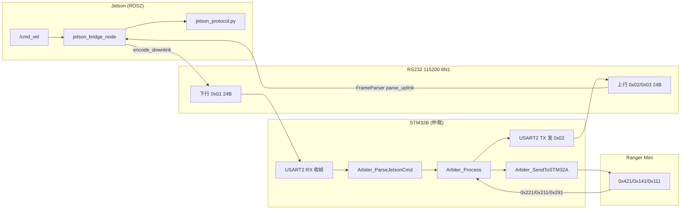

# 机器人通信文档

| 文件 | 说明 |
|------|------|
| **[JETSON_CAN_ROS2集成设计.md](./JETSON_CAN_ROS2集成设计.md)** | **ROS2 CAN 架构总文档**（节点、消息、Topic、开发计划） |
| **[JETSON_RS232_ROS2集成设计.md](./JETSON_RS232_ROS2集成设计.md)** | **ROS2 RS232 架构总文档**（Topic 分发、gateway、与 CAN 对称） |
| **[以太网接入与联调.md](./以太网接入与联调.md)** | **以太网 UDP BLOB v2**（IP、eth_gateway、Topic、联调步骤） |
| **[JETSON时间同步联调.md](./JETSON时间同步联调.md)** | **USART2 时间同步**（START/PING/QUERY、offset/RTT、联调步骤） |
| **[LIDAR移植.md](./LIDAR移植.md)** | **RPLIDAR S2** 接入、编译、联调与验证（`/scan`） |
| [TOPIC_NAMING.md](./TOPIC_NAMING.md) | Topic 命名速查表 |
| [Jetson_CAN协议.md](./Jetson_CAN协议.md) | CAN2 完整协议（v1.4 定稿） |
| [PROTOCOL_V3.md](./PROTOCOL_V3.md) | **V3 24B 串口/CAN 应用层帧**（Jetson ↔ STM32B） |
| [STM32B_FIRMWARE_NOTES.md](./STM32B_FIRMWARE_NOTES.md) | STM32B 固件说明 |
| 下文 | 串口联调、`ds_jetson_bridge`、GPS/IMU 等实操 |

---

## Jetson ↔ STM32B RS232 数据流（接收 / 解析 / 控制）

本节描述 **V3 协议** 在 Jetson 与 STM32B 之间的完整链路。帧格式细节见 [PROTOCOL_V3.md](./PROTOCOL_V3.md)；B 板固件实现见 [STM32B_FIRMWARE_NOTES.md](./STM32B_FIRMWARE_NOTES.md)。

### 系统总览

```text
  ROS2 /cmd_vel                    UART V3 24B              CAN 500K
  teleop / 规划  ──►  jetson_bridge  ◄──►  STM32B  ◄──►  Ranger(STM32A)
                         │                  │
                    Prolific USB         USART2 PA2/3
                    /dev/ttyUSB5         (Jetson 专用)
                         │
                    勿接 USART1 PA9/10（那是 [DS]/[BOOT] 调试文本口）
```



### 物理层与接线（必核对）

| 项目 | 配置 |
|------|------|
| 电气 | USB 转 RS232/TTL（现场多为 **Prolific**） |
| 波特率 | **115200**，8 数据位，无校验，1 停止位（8N1） |
| 字节序 | 多字节字段 **大端（BE）** |
| Jetson 设备 | `/dev/serial/by-id/usb-Prolific_...-port0` → 通常 `ttyUSB5` |
| STM32B Jetson 口 | **USART2**：`PA2=TX`，`PA3=RX`（代码里历史命名可能写 USART3） |
| STM32B 调试口 | **USART1** `PA9/PA10`：只打 `[DS]`、`[BOOT]` 等**文本**，不是 V3 二进制 |

**正确交叉接线：**

```text
Jetson USB-TTL TX  ──►  STM32 PA3 (USART2_RX)
Jetson USB-TTL RX  ◄──  STM32 PA2 (USART2_TX)
GND                ───  GND
```

接反时常见现象：**probe 能收到 `0x02`，但 B 板永远没有 `[JETSON CMD]`，bridge 刷 `Waiting for 0x02` 或只有 TX 无 RX**。

### V3 帧外壳（双方共用，固定 24 字节）

| 偏移 | 字段 | 说明 |
|------|------|------|
| 0 | `0xAA` | 帧头 |
| 1 | `frame_type` | `0x01` 下行，`0x02` 状态上行，`0x03` 扩展上行 |
| 2 | `seq` | 0~255 循环；**每发一帧 +1**（含零速心跳） |
| 3~22 | payload | 见下表 |
| 23 | `xor` | Byte0~Byte22 逐字节异或 |

**合法帧条件：** `header==0xAA`、类型合法、`xor` 校验通过、长度恰好 24。

---

### Jetson 侧：接收 / 解析 / 控制

实现文件：`jetson_bridge_node.py` + `jetson_protocol.py`。

#### 1. 控制输入（ROS → 待发指令）

```text
/cmd_vel (geometry_msgs/Twist)
  linear.x, linear.y, angular.z
       │
       ▼
_cmd_vel_cb()
  · cruise_scale 缩放
  · max_linear / max_angular 限幅
       │
       ▼
twist_to_motion()  →  pending: v_mm_s, omega, steer, motion_model
```

| 输入场景 | `motion_model` | 下发要点 |
|----------|----------------|----------|
| `i` 前进 | 0 ACKERMANN | `v` + `omega` |
| `i`+`j` 弧线 | 0 ACKERMANN | `v` + `omega` |
| 单独 `j`/`l`（默认） | 1 SIDEWAYS | `v` + `steer=±1571`，`omega=0` |
| 单独 `j`/`l`（`strafe_jl:=false`） | 2 SPIN | `omega`，`v=0` |

结果缓存在 `_pending_*`，**不立刻发串口**；由 50Hz 定时器统一组帧。

#### 2. 定时下发（50Hz `_tick`）

```text
_tick() 每 20ms
  ├─ _ensure_serial()          断线则 auto_reconnect
  ├─ _build_downlink()         安全逻辑 → DownlinkCommand
  │    ├─ cmd_timeout 超时 → v/ω/steer=0（seq 仍递增）
  │    ├─ 运动后断令 → RECOVER 1s 零速（RECOVER_STABLE_MS=1000）
  │    └─ bridge= RUN / IDLE / RECOVER
  ├─ encode_downlink()         24B，type=0x01，计算 xor
  ├─ serial.write(24B)         → STM32 USART2_RX
  └─ _poll_uplink()             读串口 → 解析上行
```

**下行 payload（`0x01`）关键字段：**

| 偏移 | 字段 | Jetson 填入 |
|------|------|-------------|
| 3 | `mode_req` | 上电前 50 帧固定 `1`（CAN）；之后用 `mode_req` 参数 |
| 4~5 | `v_cmd` | mm/s，s16 BE |
| 6~7 | `omega_cmd` | 0.001 rad/s，s16 BE |
| 8~9 | `steer_cmd` | 0.001 rad；横移 ±1571 |
| 10 | `motion_model` | 0/1/2/3 |

#### 3. 上行接收与解析

```text
serial.read() 原始字节流
       │
       ▼
FrameParser.feed()
  · 在缓冲区找 0xAA
  · 认 type ∈ {0x01,0x02,0x03}
  · 凑满 24B 且 xor 正确 → yield frame
       │
       ▼
parse_uplink_status()   （仅处理 type=0x02）
  · safety_state, limit_factor, link_state
  · v_actual, omega_actual, steer_actual
  · sonar_front/back/left/right, battery
       │
       ▼
_publish_status()  →  stm32b/* 话题 + stm32b/status 中文摘要
```

**上行 `0x02` payload 要点：**

| 偏移 | 字段 | 发布到 ROS |
|------|------|------------|
| 3 | `safety_state` | `stm32b/safety_state`（1~4） |
| 4 | `link_state` | `stm32b/link_state`（bit0=Jetson 心跳） |
| 5 | `limit_factor` | `stm32b/limit_factor`（0~100%） |
| 6~7 | `v_actual` | `stm32b/motion_actual.linear.x` |
| 8~9 | `omega_actual` | `stm32b/motion_actual.angular.z` |
| 12~19 | 四向超声 mm | `stm32b/sonar_mm` |

**告警逻辑：**

- 开机后 `_last_uplink_time==0` 且已发 TX 数秒 → `Waiting for STM32B 0x02 uplink`
- 曾有上行但 **300ms** 无新 `0x02` → `No valid 0x02 uplink`
- USB 热插拔 → flush 脏数据 → prime 15 帧下行 → 读 0.6s 窗口等 `0x02`

#### 4. Jetson 侧时序参数

| 参数 | 典型值 | 含义 |
|------|--------|------|
| `rate_hz` | 50 | 下行周期 20ms |
| `cmd_timeout_ms` | 500~2000 | 无 `/cmd_vel` 后发零速 |
| `RECOVER_STABLE_MS` | 1000 | 运动中断指令后强制 1s 零速 |
| `UPLINK_TIMEOUT_MS` | 300 | 无有效上行告警 |
| B 侧心跳判定 | 300ms | `seq` 未更新 → `link_state.bit0=1` |

---

### STM32B 侧：接收 / 解析 / 控制

实现位置：B 板固件 `arbiter.c` + `usart`（**硬件 USART2**）。主循环约 **20ms**。

#### 1. 下行接收（Jetson → B）

```text
USART2 中断/轮询收字节
       │
       ▼
USART_GetJetsonFrame() / 帧同步
  · 找 0xAA，type=0x01，24B，xor OK
       │
       ▼
Arbiter_ParseJetsonCmd()
  · 解析 v, omega, steer, motion_model, mode_req, seq
  · seq 变化 → 刷新 Jetson 心跳计时（300ms 窗口）
  · motion_model 变化 → Arbiter_SetMotionMode() → CAN 0x141
  · 调试口打印 [JETSON CMD] v=... steer=... motion=...
       │
       ▼
写入 arb_state.jetson_cmd
```

**无 `[JETSON CMD]` 的常见原因：** USB 未接到 PA2/PA3、TX/RX 未交叉、波特率不一致、xor/帧长与 Jetson 不一致。

#### 2. 仲裁与本地传感（B 内部）

```text
Arbiter_SetObstacleDistances()   ← USART3 超声 IF1~4
Arbiter_ProcessCANFeedback()     ← 收 0x221/0x211/0x291/0x361 ...
       │
       ▼
Arbiter_Process()
  · NORMAL：透传 jetson v/ω/steer（须已修 P0：steering 不强制置 0）
  · SPEED_LIMIT：按 limit_factor 缩放 v
  · DEGRADED：本地避障策略，常覆盖 Jetson（心跳丢失或超声异常）
  · EMERGENCY：强制 v=0, ω=0
       │
       ▼
arb_state.output（仲裁后输出）
```

| `safety_state` | B 行为（简述） |
|----------------|----------------|
| 1 NORMAL | 透传 Jetson 指令到 CAN |
| 2 SPEED_LIMIT | 按比例限速 |
| 3 DEGRADED | 本地策略，不听 Jetson |
| 4 EMERGENCY | 强制停车 |

#### 3. 下发底盘（B → Ranger CAN）

```text
Arbiter_SendToSTM32A()  约 20ms
  ├─ mode_req=1 时发 0x421 = 0x01（CAN 指令模式）
  ├─ motion_model 变化发 0x141（0 阿克曼 / 1 斜移 / 2 自旋）
  ├─ 0x291.switching==1 或 0x211==遥控(0x03) → 仅发零速 0x111
  └─ 否则周期发 0x111：v(mm/s), omega, steer(0.001rad)
```

**横移 `j`/`l` 时 CAN 期望：**

| CAN ID | 内容 |
|--------|------|
| `0x141` | `0x01` 斜移 |
| `0x111` | `v≈300`，`steer=±1571`，`omega=0` |

调试口应出现：`[CMDOUT] v=300 steer=1571 ... mode=NORMAL`。

#### 4. 上行组帧（B → Jetson）

```text
USART_SendV3StatusFrame()   type=0x02, 20ms
  · safety_state, limit_factor, link_state
  · 来自 0x221 的 v/ω/steer
  · 四向超声 mm、电池电压/SOC

USART_SendV3DetailFrame()   type=0x03, 与 0x02 交替（可选）
  · 0x281 轮速、0x271 转角等
       │
       ▼
USART2 TX (PA2) → Jetson USB-RX
```

**注意：** `0x02` 上行与是否收到 Jetson 下行**无关**；只要 B 固件主循环在跑，PA2 上应持续有二进制帧（约 20Hz）。Jetson `probe_tty` 可独立验证。

#### 5. STM32B 主循环顺序（检查清单）

```c
/* 每 20ms */
if (USART_GetJetsonFrame(buf))
    Arbiter_ParseJetsonCmd(buf, 24);      /* ① 收 Jetson */

Arbiter_SetObstacleDistances(...);        /* ② 超声 */
Arbiter_ProcessCANFeedback();             /* ③ CAN 回馈 */
Arbiter_Process();                        /* ④ 仲裁 */
Arbiter_SendToSTM32A();                   /* ⑤ 发底盘 */

USART_SendV3StatusFrame(...);             /* ⑥ 上行 0x02 */
USART_SendV3DetailFrame(...);             /* ⑦ 上行 0x03（可选） */
```

缺 ① 则无 `[JETSON CMD]`；缺 ⑥ 则 Jetson 永远 `Waiting for 0x02`。

---

### 端到端控制示例（按住 `i` 前进）

```text
1. teleop 发 /cmd_vel: linear.x=0.2
2. Jetson twist_to_motion → v_cmd=200, motion=ACKERMANN
3. Jetson TX: AA 01 seq .. v=200 .. xor
4. STM32 Parse → [JETSON CMD] v=200 motion=0
5. 仲裁 NORMAL → [CMDOUT] v=200
6. CAN 0x111 → Ranger 前进
7. CAN 0x221 回馈 v_actual≈197
8. STM32 组 0x02 → safety=1, v_actual=197, sonar=...
9. Jetson RX: 仲裁=NORMAL 底盘实际v=197mm/s
10. ROS stm32b/motion_actual.linear.x ≈ 0.197
```

### 联调判据（一眼区分问题在哪一段）

| Jetson 日志 | STM32 调试口 | 结论 |
|-------------|--------------|------|
| 只有 TX，无 RX | 无 `[JETSON CMD]` | **下行没到 USART2**（接线/port） |
| 只有 TX，无 RX | 有 `[JETSON CMD]` | **上行 PA2→Jetson 不通** 或 bridge 占口异常 |
| TX+RX 正常 | 有 CMD，无 CMDOUT | 仲裁 DEGRADED/EMERGENCY 或 CAN 未通 |
| TX `SIDEWAYS` | CMDOUT steer=±1571 | Jetson+B 串口正常；车不动查 0x291/遥控/急停 |
| `bridge=RUN` v=200 | `limit=0%` | 超声太近，B 限速为 0 |

独立验证串口（**先停 bridge**）：

```bash
ros2 run ds_jetson_bridge probe_tty -- --time 5
# ttyUSB5 uplink 0x02 应 >> 0
```

---

## 代码与文件（`ds_jetson_bridge`）

| 路径 | 作用 |
|------|------|
| `src/ds_jetson_bridge/ds_jetson_bridge/jetson_bridge_node.py` | ROS 节点：串口收发、重连、`/cmd_vel` → 24B 下行 |
| `src/ds_jetson_bridge/ds_jetson_bridge/jetson_protocol.py` | V3 协议：组帧/解帧、`twist_to_motion()`、中文 status 字符串 |
| `src/ds_jetson_bridge/launch/jetson_bridge.launch.py` | launch 默认参数（**优先于**节点内置默认） |
| `src/ds_jetson_bridge/ds_jetson_bridge/probe_tty.py` | 独立探测：哪路 tty 有 0x02 上行 |
| `docs/PROTOCOL_V3.md` | 24B 帧格式权威说明 |

### 主流程（`jetson_bridge_node.py`）

完整 RS232 收发/解析/控制见上文 **「Jetson ↔ STM32B RS232 数据流」**。节点内简图：

```text
main()
  └─ JetsonBridgeNode.__init__     打开串口、订阅 /cmd_vel、50Hz 定时器
       ├─ _cmd_vel_cb()            Twist → pending v/ω/steer（jetson_protocol.twist_to_motion）
       └─ _tick() 每 20ms
            ├─ _ensure_serial()    断线重连 / _on_serial_restored() flush+prime+读上行
            ├─ _build_downlink()   RUN/IDLE/RECOVER 安全逻辑 → encode_downlink()
            ├─ _ser.write(24B)     下发 STM32B
            └─ _poll_uplink()       FrameParser → parse_uplink_status → 发布 stm32b/*
```

### ROS 话题

| 话题 | 类型 | 方向 | 说明 |
|------|------|------|------|
| `/cmd_vel` | `geometry_msgs/Twist` | 订阅 | 速度指令输入 |
| `stm32b/status` | `std_msgs/String` | 发布 | **中文可读** 一行状态（推荐监视） |
| `stm32b/safety_state` | `std_msgs/UInt8` | 发布 | 1~4 仲裁状态 |
| `stm32b/limit_factor` | `std_msgs/UInt8` | 发布 | 0~100 限速 % |
| `stm32b/link_state` | `std_msgs/UInt8` | 发布 | bit0=Jetson 心跳，bit1=CAN |
| `stm32b/motion_actual` | `geometry_msgs/Twist` | 发布 | 底盘实际 v/ω |
| `stm32b/sonar_mm` | `std_msgs/UInt16MultiArray` | 发布 | [前,后,左,右] mm |
| `stm32b/battery_voltage` | `std_msgs/Float32` | 发布 | 电压 V |
| `stm32b/battery_soc` | `std_msgs/UInt8` | 发布 | 电量 % |
| `stm32b/uplink_seq` | `std_msgs/UInt8` | 发布 | B 板上行帧序号 |

---

## ROS 参数一览

**说明：** 用 `ros2 launch ...` 时以 **launch 默认值**为准；直接 `ros2 run ds_jetson_bridge jetson_bridge` 时用 **节点 `declare_parameter` 默认值**。

### launch 可配（`jetson_bridge.launch.py`）

| 参数 | launch 默认 | 节点默认（未走 launch 时） | 含义 |
|------|-------------|---------------------------|------|
| `cmd_port` | `/dev/ttyUSB5` | 同左 | 串口设备，**建议 by-id** |
| `cmd_baud` | `115200` | 同左 | 波特率 |
| `rate_hz` | `50.0` | 同左 | 下行周期 Hz（50Hz=20ms） |
| `cmd_timeout_ms` | `500` | `200` | 无 `/cmd_vel` 超过此值 → 零速 |
| `cruise_scale` | `1.0` | `0.7` | `/cmd_vel` 缩放系数 |
| `max_linear_m_s` | `0.8` | 同左 | 线速度上限 m/s |
| `max_angular_rad_s` | `1.0` | 同左 | 角速度上限 rad/s |
| `mode_req` | `1` | `1` (MODE_CAN) | 下行 mode_req：0待机 1CAN 2遥控 |
| `strafe_jl_from_angular` | `true` | 同左 | `j`/`l`→横移；`false`→自旋 |
| `strafe_speed_m_s` | `0.3` | 同左 | 横移线速度 m/s |
| `sideways_steer_millirad` | `1571` | 同左 | 横移目标转角 ≈90° |
| `auto_reconnect` | `true` | 同左 | USB 断线自动重连 |
| `reconnect_interval_s` | `1.0` | 同左 | 设备消失时重试 open 间隔 |
| `reconnect_settle_s` | `0.15` | 同左 | close/open 稳定等待 |
| `reconnect_uplink_deadline_s` | `2.0` | 同左 | reopen 后无 0x02 → hard reconnect |

### 仅节点代码（launch 未暴露，需 `--ros-args -p`）

| 参数 | 默认 | 代码位置 | 含义 |
|------|------|----------|------|
| `motion_model` | `0` | `jetson_bridge_node.py` | 默认运动模型（通常由 twist 映射覆盖） |
| `mode_hold_frames` | `50` | 同左 | 上电前 N 帧强制 `mode_req=CAN` |
| `log_tx` | `true` | 同左 | 每秒打印 TX/RX 摘要 |

未在 launch 里的参数示例：

```bash
ros2 run ds_jetson_bridge jetson_bridge --ros-args \
  -p cmd_port:=/dev/serial/by-id/usb-Prolific_Technology_Inc._USB-Serial_Controller-if00-port0 \
  -p log_tx:=false \
  -p mode_hold_frames:=100
```

### 协议常量（`jetson_protocol.py`，一般不改）

| 常量 | 值 | 含义 |
|------|-----|------|
| `FRAME_HEADER` | `0xAA` | 帧头 |
| `FRAME_LEN` | `24` | 帧长 |
| `FRAME_TYPE_DOWN` / `UP_STATUS` | `0x01` / `0x02` | 下行 / 上行状态 |
| `MAX_V_MM_S` | `2000` | 线速度上限 mm/s |
| `MAX_OMEGA_MILLIRAD_S` | `3259` | 角速度上限 0.001 rad/s |
| `MAX_STEER_SIDEWAYS_MILLIRAD` | `1571` | 横移 ≈90° |
| `RECOVER_STABLE_MS` | `1000` | 运动中断指令后强制零速 1s（代码写死） |
| `CMD_TIMEOUT_MS` | `200` | 节点默认 cmd 超时（launch 可覆盖） |
| `UPLINK_TIMEOUT_MS` | `300` | 无有效上行告警阈值 |

### `/cmd_vel` → 24B 下行映射（`twist_to_motion()`）

| 键盘/ Twist | `motion_model` | 下发字段 |
|-------------|----------------|----------|
| `i` 前进 `linear.x` | `0` ACKERMANN | `v` + `omega` |
| `i`+`j` 弧线 | `0` ACKERMANN | `v` + `omega` |
| 单独 `j`/`l`（默认） | `1` SIDEWAYS | `v` + `steer=±1571` |
| 单独 `j`/`l`（`strafe_jl:=false`） | `2` SPIN | `omega` |

### 安全逻辑 `_build_downlink()`（`bridge=` 日志）

| 条件 | `bridge=` | 下发 |
|------|-----------|------|
| 有效 `/cmd_vel` 且未超时 | `RUN` | pending 非零速度 |
| 无指令或 pending=0 | `IDLE` | `v=0` |
| 刚运动过且 `cmd_timeout` 超时 | `RECOVER` | 连续 1s `v=0`（`RECOVER_STABLE_MS`） |

---

## 编译（改代码后执行一次）

```bash
cd ~/catkin_ws
source /opt/ros/humble/setup.bash
colcon build --packages-select ds_jetson_bridge --symlink-install
source ~/catkin_ws/install/setup.bash
```

---

## 串口打不开（`OSError: [Errno 5] Input/output error`）

`jetson_bridge` 默认使用 **Prolific** 对应的 STM32B 口（`/dev/ttyUSB5` 或 by-id 下的 `usb-Prolific_...-port0`）。**不要用 Quectel 模组的 ttyUSB0~4。**

```bash
ls -l /dev/serial/by-id/
# 应看到 usb-Prolific_Technology_Inc._USB-Serial_Controller-... -> ttyUSB5
```

若 launch 报 **Errno 5**，内核日志里常有 `pl2303 ... failed: -32`，表示 USB 转串口芯片无响应：

1. **拔掉** Jetson 连 STM32B 的那根 USB，等 3～5 秒，**再插上**。
2. 确认无其它程序占用：`fuser -v /dev/ttyUSB5`（有输出则先 `pkill` 对应进程）。
3. 用稳定设备名启动：

```bash
ros2 launch ds_jetson_bridge jetson_bridge.launch.py \
  cmd_port:=/dev/serial/by-id/usb-Prolific_Technology_Inc._USB-Serial_Controller-if00-port0
```

4. 仍失败：换 USB 口/线，或在 B 板复位后再试。

### USB 热插拔（运行中拔线再插上）

`jetson_bridge` 已带 **自动重连**（启动日志里应有 `serial reconnect=on`）。流程：

```text
Serial I/O lost ... Errno 5          ← 拔线
Serial open failed ... Errno 2       ← 设备消失，正常
Serial restored ... try 1 ...        ← 插回，flush 脏数据 + 发下行 + 读上行
Hard serial reconnect ...            ← 仍无有效 0x02 时自动再开一次口（约 0.15s 后）
Serial restored ... 0x02 uplink OK   ← 恢复成功
RX 上行 ...
```

**注意：** 不要看到 `process has died`；若反复失败，**复位 STM32B** 或 **Ctrl+C 重启 bridge** 比一直挂着更可靠。

重连相关参数见上文 **「ROS 参数一览 → launch 可配」**；实现函数：`_open_serial`、`_bringup_serial_link`、`_hard_reconnect`（均在 `jetson_bridge_node.py`）。

更快重连（可选）：

```bash
ros2 launch ds_jetson_bridge jetson_bridge.launch.py \
  cmd_port:=/dev/serial/by-id/usb-Prolific_Technology_Inc._USB-Serial_Controller-if00-port0 \
  reconnect_uplink_deadline_s:=1.0
```

独立验证串口（**bridge 需先 Ctrl+C 停掉**，避免占口）：

```bash
ros2 run ds_jetson_bridge probe_tty -- --time 5
# 应看到 uplink 0x02 > 0
```

---

## 停止后台节点（联调前先清场）

ROS 节点用 `Ctrl+C` 结束后，有时子进程仍在。在任意终端执行：

```bash
# 结束本项目的桥接、键盘遥控、topic pub 等
pkill -f "jetson_bridge" 2>/dev/null
pkill -f "teleop_twist_keyboard" 2>/dev/null
pkill -f "ros2 topic pub" 2>/dev/null
pkill -f "ds_serial_monitor" 2>/dev/null

# 确认已干净（应无输出或只剩 bash）
source /opt/ros/humble/setup.bash
source ~/catkin_ws/install/setup.bash
ros2 node list
```

说明：没有单独的「删除 topic」命令；**节点退出后 `/cmd_vel` 等 topic 会自动消失**。若 `ros2 node list` 仍有个别残留，对该终端再 `Ctrl+C`，或 `kill -9 <pid>`（`pgrep -af teleop` 查 pid）。

---

## Jetson 联调（三终端）

**不要同时**开「方式 A topic pub」和「方式 B 键盘」，二者都会发 `/cmd_vel`，会互相抢。

每个终端先执行：

```bash
source ~/catkin_ws/install/setup.bash
```

### 终端 1 — 桥接（先开，保持运行）

**推荐（稳定 by-id 口 + 键盘松手 2s 才清零 + 自动重连）：**

```bash
ros2 launch ds_jetson_bridge jetson_bridge.launch.py \
  cmd_port:=/dev/serial/by-id/usb-Prolific_Technology_Inc._USB-Serial_Controller-if00-port0 \
  cmd_timeout_ms:=2000
```

仅默认值（`cruise_scale=1.0`：`linear.x: 0.2` → 下发 **200 mm/s**）：

```bash
ros2 launch ds_jetson_bridge jetson_bridge.launch.py
```

launch 已暴露的参数见 **「ROS 参数一览」**。常用 override 示例：

```bash
# 横移更慢
ros2 launch ds_jetson_bridge jetson_bridge.launch.py strafe_speed_m_s:=0.15

# j/l 改原地自旋
ros2 launch ds_jetson_bridge jetson_bridge.launch.py \
  strafe_jl_from_angular:=false max_angular_rad_s:=0.3
```

**`j` / `l` 横移太慢：** `strafe_speed_m_s:=0.15`

**`j` / `l` 改回原地旋转：** `strafe_jl_from_angular:=false max_angular_rad_s:=0.3`

### 终端 2 — 速度指令（二选一）

**方式 A — 持续前进（推荐联调）：**

```bash
ros2 topic pub /cmd_vel geometry_msgs/msg/Twist \
  "{linear: {x: 0.2}, angular: {z: 0.0}}" -r 20
```

**方式 B — 键盘遥控：**

```bash
# 未安装时：
sudo apt install -y ros-humble-teleop-twist-keyboard

ros2 run teleop_twist_keyboard teleop_twist_keyboard
```

| 键 | 作用 |
|----|------|
| `i` | 前进（须**长按**，不是点一下） |
| `,` | 后退 |
| `j` / `l` | **横移**左 / 右（斜移，车头朝向不变；bridge 默认 `strafe_jl_from_angular:=true`） |
| `i`+`j` / `i`+`l` | 前进中弧线左转 / 右转（阿克曼） |
| `k` | 停止 |
| `q` / `z` | 加 / 减 最大速度 |

键盘窗口必须有焦点。松手超过 `cmd_timeout_ms` 后，bridge 会先进入 **1 秒零速**（日志 `bridge=RECOVER`，见下文）。

横移对应 Ranger 手册 **斜移模式**（`0x141=0x01`，转角约 ±90°）。单独 `j`/`l` 时 TX 日志应出现 `motion=SIDEWAYS steer=±1571`。

**确认键盘在发（可选，第四个终端）：**

```bash
ros2 topic hz /cmd_vel
# 按住 i 时应约 10 Hz；松手后为 0
```

### 终端 3 — 状态监视

**推荐（中文可读，一条看完）：**

```bash
ros2 topic echo /stm32b/status
```

示例输出（正常）：

```text
data: Jetson串口=已连接 仲裁=限速避障(SPEED_LIMIT) 限速=0% B板报告Jetson心跳=正常 ...
```

拔线后应变为：

```text
data: Jetson串口=断开 USB未连接或重连中 请插回线缆并等3~5秒 (无STM32B实时数据)
```

重连后若只有 TX、无 RX：

```text
data: Jetson串口=已连接 STM32B上行=无 已发TX等待0x02 若超过5秒仍无RX请复位B板或重插USB
```

原始数字话题（给程序用）：

```bash
ros2 topic echo /stm32b/safety_state   # 1~4，见下表
ros2 topic echo /stm32b/limit_factor   # 0~100 限速百分比
```

| `safety_state` | 含义 |
|----------------|------|
| 1 | NORMAL — 易透传 Jetson 速度 |
| 2 | SPEED_LIMIT — 按 `limit_factor` 限速 |
| 3 | DEGRADED — 本地策略，常不听 Jetson |
| 4 | EMERGENCY — 强制停车 |

---

## 终端 1 日志怎么读（TX / RX）

| 日志 | 方向 | 含义 |
|------|------|------|
| **TX 下发** | Jetson → STM32B | `/cmd_vel` 经 bridge 发出的速度 |
| **RX 上行** | STM32B → Jetson | 仲裁状态 + **底盘实际速度** |

### `bridge=` 三种模式

| 值 | 含义 |
|----|------|
| **RUN** | 正在下发非零速度（`/cmd_vel` 有效且未超时） |
| **IDLE** | 发零速（本来就没动，或 pending 为 0） |
| **RECOVER** | 刚运动完又断指令，**强制 1 秒零速** |

### 常见 WARN

| 日志 | 含义 | 要不要管 |
|------|------|----------|
| `cmd_vel lost after motion -> 1s zero (recovery)` | 之前有速度，超过 `cmd_timeout_ms` 没收到新 `/cmd_vel` | 松手/断令时**正常**；逻辑在 `_build_downlink()` + `RECOVER_STABLE_MS=1000` |
| `Waiting for STM32B 0x02 uplink` | 串口开着但还没解析到上行 | 刚启动或重连中，等几秒 |
| `Serial I/O lost ... Errno 5` | USB 拔线或 pl2303 僵死 | 插回或重启 bridge |
| `Hard serial reconnect` | 重连后仍无有效 0x02，自动再开串口 | 热插拔后**正常**，应随后出现 RX |

示例：

```text
TX 下发 seq=84 v=200mm/s ... bridge=RUN
RX 上行 仲裁=NORMAL limit=100% 底盘实际v=197mm/s ...
```

- **TX `v=200`**：命令速度（如 `linear.x: 0.2` × `cruise_scale 1.0`）。
- **RX `底盘实际v=197`**：底盘反馈，差几 mm/s 正常。
- **TX `v=0` + RX 非零**：Jetson 已停车，B 板本地策略或惯性。
- **`limit=0%` 且车不动**：超声太近，B 仲裁停车；清障碍或 B 板 **KEY1** 关 Dist ctrl。

---

## 联调成功条件（自检）

- [ ] `ros2 node list` 只有你在用的节点（如 `/jetson_bridge`、可选 `/teleop_twist_keyboard`）
- [ ] 终端 1：`TX ... bridge=RUN` 且 `下发 v` 非 0（发令时）
- [ ] 终端 3：`ros2 topic echo /stm32b/status` 显示 `Jetson串口=已连接`，仲裁非长期 `limit=0%`
- [ ] `RX 底盘实际v` 与 TX 接近（例如 200 vs 197）
- [ ] B 串口有 `[JETSON CMD] v=...`，且 `[CMDOUT]` / `[MOTION] FB` 非长期 STOP

---

## 命令行速查

每个新终端先：

```bash
source ~/catkin_ws/install/setup.bash
```

### 一次性准备

```bash
cd ~/catkin_ws
source /opt/ros/humble/setup.bash
colcon build --packages-select ds_jetson_bridge --symlink-install
source ~/catkin_ws/install/setup.bash
```

### 联调三终端（最常用）

```bash
# 终端 1 — bridge（先开）
ros2 launch ds_jetson_bridge jetson_bridge.launch.py \
  cmd_port:=/dev/serial/by-id/usb-Prolific_Technology_Inc._USB-Serial_Controller-if00-port0 \
  cmd_timeout_ms:=2000

# 终端 2 — 键盘遥控（二选一）
ros2 run teleop_twist_keyboard teleop_twist_keyboard

# 或持续前进
ros2 topic pub /cmd_vel geometry_msgs/msg/Twist \
  "{linear: {x: 0.2}, angular: {z: 0.0}}" -r 20

# 终端 3 — 中文状态（推荐）
ros2 topic echo /stm32b/status
```

### 诊断

```bash
# 串口设备
ls -l /dev/serial/by-id/

# 谁在占串口
fuser -v /dev/ttyUSB5

# 清残留节点
pkill -f "jetson_bridge" 2>/dev/null
pkill -f "teleop_twist_keyboard" 2>/dev/null
ros2 node list

# 键盘是否在发令
ros2 topic hz /cmd_vel

# 独立测串口（先停 bridge）
ros2 run ds_jetson_bridge probe_tty -- --time 5
```

### 结束联调

各终端 `Ctrl+C` 后：

```bash
pkill -f "jetson_bridge" 2>/dev/null
pkill -f "teleop_twist_keyboard" 2>/dev/null
pkill -f "ros2 topic pub" 2>/dev/null
```

---

## GPS 模块联调（GPS.py + CH340 驱动）

在 Jetson Nano / Ubuntu 22.04 上运行 `src/GPS.py` 读取 GPS 模块时遇到的问题与解决办法。

**环境：** 内核 `5.15.185-tegra`、GPS USB 通讯（CH340 `1a86:7523`）、波特率 **9600**。

| 文件 | 说明 |
|------|------|
| `src/GPS.py` | 厂商例程：解析 `$GNGGA` / `$GNVTG` 并打印经纬度 |
| `~/install_ch341_driver.sh` | 一键编译、加载 CH341 驱动并处理 brltty 占用 |

### 本机 USB 串口对应关系

| 设备 | 端口 | 稳定路径（推荐） |
|------|------|------------------|
| Quectel RM500U 5G 模组 | `ttyUSB0`～`ttyUSB4` | `usb-Quectel_RM500U-CNV_...` |
| STM32B 桥接（Prolific PL2303） | `ttyUSB5` | `usb-Prolific_Technology_Inc._USB-Serial_Controller-if00-port0` |
| **GPS 模块（CH340）** | `1-2.2.4` → 通常 `ttyUSB6` | `/dev/gps_usb` 或 by-id（见下） |
| **IMU 模块（CH340）** | `1-2.2.3` → 通常 `ttyUSB6`/`ttyUSB7` | **`/dev/imu_usb`（推荐）** |

两块 CH340 的 by-id 名称相同（`usb-1a86_USB_Serial-if00-port0`），**不能**靠 by-id 区分 GPS/IMU，请用 udev 别名 `/dev/gps_usb`、`/dev/imu_usb`（§8.3.1）。

```bash
lsusb -t          # 看 Driver=ch341 在哪几个 Port
ls -l /dev/serial/by-id/
ls -l /dev/gps_usb /dev/imu_usb 2>/dev/null
ls /dev/ttyUSB*
```

### 问题总览

| # | 现象 | 根因 | 解决办法 |
|---|------|------|----------|
| 1 | `GPS Serial Opened!` 但从不打印 | `GPS.py` 连错端口（`ttyUSB0` 是 5G 模组） | 改端口，见下 |
| 2 | `lsusb` 有 CH340，但无 GPS 串口 | 内核未内置 CH341 驱动 | 编译加载驱动 |
| 3 | `git clone` 报 Repository not found | GitHub 地址错误或失效 | 用 WCH 官方仓库 |
| 4 | 编译报 `__dynamic_dev_dbg undefined` | Jetson 内核与 out-of-tree 模块不兼容 | 去掉 `dev_dbg` 等 |
| 5 | `insmod: Invalid module format` | 用错内核头文件编译 | 用 L4T 官方 headers |
| 6 | 驱动已加载仍无串口 | **brltty** 占用 CH340（`usbfs`） | mask brltty 并重新绑定 |
| 7 | 循环 `GPS no found` | 室内无卫星，非程序故障 | 室外等搜星；ROS2 见 §8.3.1 |
| 8 | `gps_ws`/`imu_ws` 目录错乱 / 无法在本 workspace 编译 | 嵌套进 catkin_ws + 教程是 ROS1 Melodic | 已移至 `~/gps_ws`、`~/imu_ws`，见 §8 |
| 9 | `ros2 topic echo` 报 `!rclpy.ok()` | `ros2 daemon` 状态异常（如 Ctrl+C 强退节点） | `ros2 daemon stop && ros2 daemon start` |
| 10 | `ros2 topic echo /fix` 一直无输出 | 串口被占用或未收到完整 NMEA 行 | 见 §8.3.1；确认 launch 在跑且串口有 `$GNGGA` |
| 11 | IMU 报 `/dev/imu_usb` 不存在 | udev 未装 + CH340 未 bind / **重启后 ch341 未加载** | 见 §8.3.1；`bash ~/install_ch341_driver.sh` |
| 12 | `ch341/bind: No such file` | **ch341 内核模块未加载**（重启后常见） | `bash ~/install_ch341_driver.sh` |

### 问题 1：串口能打开，但不循环打印

```bash
cd ~/catkin_ws/src && python3 GPS.py
# GPS Serial Opened! Baudrate=9600
# 之后无输出（连错口时）或循环 GPS no found（连对口但室内时）
```

也可：`python3 ~/catkin_ws/src/GPS.py`

原因：`GPS.py` 原先写死 `/dev/ttyUSB0`，本机是 Quectel 5G 模组，无 `$GNGGA` 数据。

解决（已改）：

```python
ser = serial.Serial("/dev/serial/by-id/usb-1a86_USB_Serial-if00-port0", 9600)
```

验证：

```bash
python3 -c "
import serial, time
s = serial.Serial('/dev/serial/by-id/usb-1a86_USB_Serial-if00-port0', 9600, timeout=2)
time.sleep(2)
print(s.read(300).decode('ascii', 'replace'))
s.close()
"
```

应看到 `$GNGGA`、`$GNRMC`、`$GPTXT,...,ANTENNA OK` 等。

### 问题 2 & 3：没有 GPS 串口 / Git 克隆失败

`lsusb` 可见 `1a86:7523`，但无对应 `ttyUSB`；内核 `CONFIG_USB_SERIAL_CH341 is not set`。

错误仓库（不存在）：

```bash
git clone https://github.com/juliagoda/CH341SER_LINUX.git   # 失败
git clone https://github.com/ihaolin/ch341ser_linux.git     # 失败
```

正确做法：

```bash
GIT_TERMINAL_PROMPT=0 git clone --depth 1 https://github.com/WCHSoftGroup/ch341ser_linux.git
bash ~/install_ch341_driver.sh
```

### 问题 4：编译报 `__dynamic_dev_dbg undefined`

用 `/home/rxp/nvidia/Linux_for_Tegra/source/kernel` 编译时出现。Jetson 内核未导出该调试符号。

`install_ch341_driver.sh` 编译前会自动去掉 `dev_dbg(...)` 和 `usb_serial_debug_data(...)`。

### 问题 5：`insmod: Invalid module format`

`vermagic` 相同但 **Module.symvers CRC 不一致**：

| 编译用的内核树 | `module_layout` CRC | 能否加载 |
|----------------|---------------------|----------|
| `nvidia/Linux_for_Tegra/source/kernel` | `0x25f8bfc1` | 否 |
| L4T 官方 headers（见下） | `0x24d702c7` | 是 |

**必须用 L4T 官方内核头编译：**

```text
/usr/src/linux-headers-5.15.185-tegra-ubuntu22.04_aarch64/3rdparty/canonical/linux-jammy/kernel-source/
```

`ch341.c` 从 NVIDIA 内核树复制：`nvidia/Linux_for_Tegra/source/kernel/drivers/usb/serial/ch341.c`

```bash
sudo modprobe usbserial
sudo insmod ~/ch341-driver-build/driver/ch341.ko
```

### 问题 6：驱动已加载，仍无 GPS/IMU 串口（brltty 占用或未 bind）

```bash
# 查看 CH340 是否被 brltty 占用（Driver 为空或 usbfs）
readlink -f /sys/bus/usb/devices/1-2.2.3:1.0/driver   # IMU
readlink -f /sys/bus/usb/devices/1-2.2.4:1.0/driver   # GPS
# 若为 /sys/bus/usb/drivers/usbfs → 被 brltty 占用
```

Ubuntu **brltty** 盲文服务把 CH340 当盲文显示器占用（规则：`/lib/udev/rules.d/85-brltty.rules`）。

解决：

```bash
sudo systemctl stop brltty-udev.service
sudo systemctl mask brltty-udev.service brltty.service

# 从 usbfs 解绑（若占用），再绑到 ch341（注意：用 ch341/bind，不是 ch341-uart/bind）
echo '1-2.2.3:1.0' | sudo tee /sys/bus/usb/drivers/usbfs/unbind
echo '1-2.2.4:1.0' | sudo tee /sys/bus/usb/drivers/usbfs/unbind
echo '1-2.2.3:1.0' | sudo tee /sys/bus/usb/drivers/ch341/bind
echo '1-2.2.4:1.0' | sudo tee /sys/bus/usb/drivers/ch341/bind

# 或一键处理两块 CH340：
bash ~/install_ch341_driver.sh
```

若失败，mask brltty 后**重新拔插**对应模块。成功后：

```bash
ls -l /dev/gps_usb /dev/imu_usb
ls /dev/serial/by-id/ | grep 1a86   # 两块都插时应看到两个口
```

### 问题 7：循环打印 `GPS no found`

程序与串口已正常。表示收到 `$GNGGA` 但无有效定位（室内/无卫星）：

```text
$GPTXT,...,ANTENNA OK*35
$GNGGA,,,,,,0,00,25.5,...    ← 经纬度为空
$GNRMC,,V,...               ← V = 无效
```

解决：室外开阔处等 30 秒～2 分钟搜星，再运行 `python3 GPS.py`。

**ROS2 `ds_gps_driver` 等价行为：** 室内仍会约 **1 Hz** 发布 `/fix`，但 `status=-1`（`NO_FIX`），经纬度为 `nan`——表示串口与解析正常，只是尚未定位。launch 终端每 10 秒会打印一条状态日志。

```bash
# 终端 1：保持运行
source /opt/ros/humble/setup.bash
source ~/catkin_ws/install/setup.bash
ros2 launch ds_gps_driver gps_serial.launch.py

# 终端 2：查看（命令中 topic 与 echo 之间要有空格）
source /opt/ros/humble/setup.bash
source ~/catkin_ws/install/setup.bash
ros2 topic echo /fix --once
ros2 topic hz /fix
```

室内典型输出：

```yaml
status:
  status: -1          # NO_FIX
latitude: .nan
longitude: .nan
```

室外定位成功后 `status` 变为 `0` 或更高，并出现有效经纬度。

### 问题 8：gps_ws / imu_ws 目录与 Ubuntu 版本不对应

#### 8.1 目录结构（已整理）

厂商教程要求 **两个独立 ROS1 工作空间**，放在主目录，**不要**嵌套进 `catkin_ws/src/`。

**错误（已清理）：**

```text
~/catkin_ws/src/gps_ws/src/nmea_navsat_driver/   ← 嵌套了两层 workspace
~/catkin_ws/src/imu_ws/src/                      ← 同上
```

**正确（当前布局）：**

```text
~/gps_ws/
  bind_usb.sh
  gps_usb.rules
  src/
    nmea_navsat_driver/
    nmea_msgs-master/
    gps_goal/
    imu_gps_localization-master/
    CMakeLists.txt          ← catkin 工作空间需要（Melodic 环境下创建）

~/imu_ws/
  bind_usb.sh
  imu_usb.rules
  src/
    package.xml             ← wit_ros_imu 包
    scripts/wit_normal_ros.py
    launch/rviz_and_imu.launch
    rviz/
    CMakeLists.txt          ← Melodic 环境下创建

~/catkin_ws/src/            ← 本工程 ROS2 Humble
  ds_jetson_bridge/
  ds_serial_monitor/
  ds_gps_driver/            ← ROS2 GPS 驱动
  ds_imu_driver/            ← ROS2 IMU 驱动
  ds_imu_gps_localization/  ← ROS2 IMU+GPS 融合（Python EKF）
  ds_gps_goal/              ← ROS2 经纬度→Nav2 目标
  GPS.py                    ← 纯 Python 例程，调试用
  ranger_ros2/
  ugv_sdk/
```

#### 8.2 版本不对应（核心矛盾）

| 项目 | 厂商教程 | 本机现状 |
|------|----------|----------|
| 操作系统 | Ubuntu **18.04** | Ubuntu **22.04** |
| ROS | **Melodic**（ROS1） | **Humble**（ROS2） |
| 编译 | `catkin_make` | `colcon build` |
| 启动 | `roslaunch` / `rospy` | `ros2 launch` / `rclpy` |

`gps_ws`、`imu_ws` 里的包**不能**在 `catkin_ws` 里用 `colcon build` 编译，也**不能**在本机 Ubuntu 22.04 上直接 `apt install ros-melodic-*`（Melodic 只支持 18.04）。

| 阶段 | 做什么 | 用什么 |
|------|--------|--------|
| **硬件验证** | 跑 `GPS.py`、读 NMEA | Python + CH341 驱动 |
| **IMU/GPS 融合**（已实现） | 发布 `/fused_path` | `ds_imu_gps_localization` |
| **经纬度导航**（已实现） | GPS 目标 → Nav2 | `ds_gps_goal` |

#### 8.3 ROS2 移植总览（方案 C，已实现）

| ROS1 厂商包 | ROS2 本工程 | 话题 / 功能 |
|-------------|-------------|-------------|
| `nmea_navsat_driver` | `ds_gps_driver` | `/fix`、`/vel` |
| `wit_ros_imu` | `ds_imu_driver` | `/imu/data`、`/imu/mag` |
| `imu_gps_localization` | `ds_imu_gps_localization` | `/fused_path`（EKF 融合轨迹） |
| `gps_goal` | `ds_gps_goal` | 订阅 `/gps_goal_fix`，发送 Nav2 目标 |

**编译：**

```bash
cd ~/catkin_ws
source /opt/ros/humble/setup.bash
colcon build --packages-select ds_gps_driver ds_imu_driver ds_imu_gps_localization ds_gps_goal --symlink-install
source install/setup.bash
```

**依赖（若缺）：**

```bash
sudo apt install ros-humble-nav2-msgs python3-geographiclib
```

#### 8.3.1 驱动节点

**环境（每个新终端都要 source）：**

```bash
source /opt/ros/humble/setup.bash
source ~/catkin_ws/install/setup.bash
```

**只启动 GPS：**

```bash
ros2 launch ds_gps_driver gps_serial.launch.py port:=/dev/gps_usb
```

默认 launch 参数为 by-id，**两块 CH340 同时插入时 by-id 无法区分**，请显式指定 `/dev/gps_usb`（见上表）。

**只启动 IMU：**

```bash
ros2 launch ds_imu_driver imu_serial.launch.py port:=/dev/imu_usb
```

本机 **GPS 与 IMU 均为 CH340（`1a86:7523`）**。USB hub 拓扑可能变化，**以 `lsusb -t` 为准**：

```bash
lsusb -t | grep -A1 '1a86:7523\|Driver=ch341\|Driver=$'
ls -l /dev/imu_usb /dev/gps_usb /dev/ttyUSB* 2>/dev/null
```

| 设备 | 典型 USB 路径（会变） | 稳定别名 |
|------|----------------------|----------|
| IMU | `1-2.2:1.0` 或旧布局 `1-2.2.3:1.0` | `/dev/imu_usb` |
| GPS | `1-2.3.4:1.0` 或旧布局 `1-2.2.4:1.0` | `/dev/gps_usb` |

**重启后 IMU/GPS 口消失（最常见）：** ch341 驱动未自动加载，须重新执行：

```bash
bash ~/install_ch341_driver.sh
sudo cp ~/imu_ws/imu_usb.rules /etc/udev/rules.d/
sudo udevadm control --reload-rules && sudo udevadm trigger
ls -l /dev/imu_usb /dev/gps_usb
```

脚本会编译加载 ch341、bind 所有 CH340，并**写入开机自动加载**。

**手动 bind（驱动已加载时）：**

```bash
# 先确认 ch341 已加载
lsmod | grep ch341
ls /sys/bus/usb/drivers/ch341/bind   # 应存在

# 查看 CH340 在哪些口（Driver= 为空表示未 bind）
lsusb -t

# 绑定（路径以 lsusb -t 为准，常见如下）
echo '1-2.2:1.0' | sudo tee /sys/bus/usb/drivers/ch341/bind
echo '1-2.3.4:1.0' | sudo tee /sys/bus/usb/drivers/ch341/bind
```

若绑定后仍无 `/dev/imu_usb`，**重新拔插 IMU** 再查。临时可不用别名（**以 `ls -l /dev/imu_usb` 指向的 tty 为准**）：

```bash
ros2 launch ds_imu_driver imu_serial.launch.py port:=/dev/ttyUSB6
# 或 by-path（口 1-2.2.3）：
ros2 launch ds_imu_driver imu_serial.launch.py \
  port:=/dev/serial/by-path/platform-3610000.usb-usb-0:2.2.3:1.0-port0
```

**GPS + IMU 一起：**

```bash
ros2 launch ds_gps_driver gps_imu.launch.py \
  gps_port:=/dev/gps_usb imu_port:=/dev/imu_usb
```

（`gps_imu.launch.py` 也支持分别 override `gps_port` / `imu_port`。）

**查看数据（须双终端：终端 1 保持 launch 运行，终端 2 查看）：**

```bash
# GPS
ros2 topic echo /fix
ros2 topic echo /fix --once      # 只看一条
ros2 topic hz /fix               # 室内约 1 Hz

# IMU（命令中 topic 与 echo/hz 之间要有空格）
ros2 topic echo /imu/data
ros2 topic echo /imu/data --once
ros2 topic hz /imu/data           # 约 10 Hz
```

**常见问题：**

| 现象 | 处理 |
|------|------|
| `ros2 topic echo` 报 `!rclpy.ok()` | `ros2 daemon stop && ros2 daemon start` 后重试 |
| echo 一直无输出 | 确认终端 1 的 launch **仍在运行**（勿 Ctrl+C）；`ros2 node list` 应有对应 driver 节点 |
| 需读原始 NMEA | 先 `Ctrl+C` 停 GPS launch（串口独占），再 `timeout 5 cat /dev/gps_usb` 或 by-id |
| 室内 `/fix` 为 `status: -1`、经纬度 `nan` | **正常**，见上文「问题 7」 |
| IMU 报 `No such file: /dev/imu_usb` | 见上文 IMU 两步：绑定 `1-2.2.3` + 安装 udev |
| `ch341-uart/bind: Permission denied` | 本机无此文件，改用 `/sys/bus/usb/drivers/ch341/bind` |
| `/imu/data` 无数据但串口已打开 | 确认 launch 未退出；`ros2 topic hz /imu/data` 应约 10 Hz |

#### 8.3.2 IMU/GPS 融合（替代 `imu_gps_test.launch`）

等价于厂商 `roslaunch imu_gps_localization imu_gps_test.launch`：

```bash
# 一条命令：GPS 驱动 + IMU 驱动 + 融合节点
ros2 launch ds_imu_gps_localization imu_gps_test.launch.py
```

或已有 `/fix`、`/imu/data` 时只开融合：

```bash
ros2 launch ds_imu_gps_localization imu_gps_fusion.launch.py
ros2 topic echo /fused_path
```

**源码：** C++ EKF 已用 Python/Numpy 重写：
- `ds_imu_gps_localization/imu_gps_localizer.py` — 核心 EKF
- `ds_imu_gps_localization/localization_node.py` — ROS2 订阅/发布

#### 8.3.3 经纬度导航（替代 `gps_goal`）

等价于厂商 `roslaunch gps_goal gps_goal.launch`（ROS2 使用 **Nav2** 替代 move_base）：

```bash
# 终端 1：Nav2 导航栈（需已有地图）
ros2 launch ds_gps_goal gps_goal.launch.py

# 终端 2：设置地图原点经纬度（我在哪）
# 注意：PoseStamped 里 position.x=纬度，position.y=经度（与厂商 gps_goal 约定一致）
ros2 topic pub --once /local_xy_origin geometry_msgs/PoseStamped \
  "{header: {frame_id: 'map'}, pose: {position: {x: 22.578850, y: 113.918636, z: 0.0}}}"

# 终端 3：发送 GPS 目标点（我去哪）
ros2 topic pub --once /gps_goal_fix sensor_msgs/NavSatFix \
  "{latitude: 22.578854, longitude: 113.918640, altitude: 0.0}"
```

节点会把经纬度换算成 map 坐标系下的 `(x,y)`，通过 Nav2 `navigate_to_pose` 发目标。若无 Nav2，设 `use_nav2:=false` 则只发布 `/goal_pose`。

**源码：** `ds_gps_goal/gps_goal_node.py`（由厂商 Python 版 `gps_goal.py` 移植）

#### 8.3.4 源码位置

| 包 | 节点 | 源文件 |
|----|------|--------|
| `ds_gps_driver` | `gps_serial` | `gps_serial_node.py` |
| `ds_imu_driver` | `wit_imu` | `wit_imu_node.py` |
| `ds_imu_gps_localization` | `imu_gps_localization` | `localization_node.py` + `imu_gps_localizer.py` |
| `ds_gps_goal` | `gps_goal` | `gps_goal_node.py` |

#### 8.4 备选：仍用 ROS1 厂商包（Docker / 虚拟机）

若需完全复现厂商 `roslaunch imu_gps_test.launch`，可用 Docker 跑 Melodic 并挂载 `~/gps_ws`、`~/imu_ws`（见原方案 A/B，略）。

#### 8.5 本机 ROS2 工程编译

**仅 Jetson 桥接：**

```bash
cd ~/catkin_ws
source /opt/ros/humble/setup.bash
colcon build --packages-select ds_jetson_bridge --symlink-install
source install/setup.bash
```

**GPS / IMU 相关包（与 §8.3 相同）：**

```bash
colcon build --packages-select ds_gps_driver ds_imu_driver ds_imu_gps_localization ds_gps_goal --symlink-install
source install/setup.bash
```

### 开机持久化

```bash
sudo cp ~/ch341-driver-build/driver/ch341.ko \
  /lib/modules/$(uname -r)/kernel/drivers/usb/serial/
sudo depmod -a
echo ch341 | sudo tee /etc/modules-load.d/ch341.conf
sudo systemctl mask brltty-udev.service brltty.service
```

内核升级后重新执行：`bash ~/install_ch341_driver.sh`

### 完整操作流程

**硬件验证（纯 Python，不依赖 ROS）：**

```bash
bash ~/install_ch341_driver.sh
ls /dev/serial/by-id/ | grep 1a86
cd ~/catkin_ws/src && python3 GPS.py
```

**ROS2 驱动（推荐）：**

```bash
cd ~/catkin_ws
source /opt/ros/humble/setup.bash
colcon build --packages-select ds_gps_driver ds_imu_driver --symlink-install
source install/setup.bash

# GPS（室外）
ros2 launch ds_gps_driver gps_serial.launch.py port:=/dev/gps_usb
# 另开终端：ros2 topic echo /fix --once

# IMU
ros2 launch ds_imu_driver imu_serial.launch.py port:=/dev/imu_usb
# 另开终端：ros2 topic echo /imu/data --once
```

### 故障速查

| 检查项 | 命令 | 期望 |
|--------|------|------|
| USB 识别 | `lsusb \| grep 1a86` | `1a86:7523` |
| 驱动加载 | `lsmod \| grep ch341` | 有 `ch341` |
| brltty | `systemctl is-active brltty-udev` | `inactive` / `masked` |
| GPS 节点 | `ls /dev/serial/by-id/ \| grep 1a86` | `usb-1a86_USB_Serial-if00-port0` |
| 是否定位 | `$GNGGA` fix quality 字段 | `0`=未定位，`1+`=已定位 |
| ROS2 节点 | `ros2 node list` | 有 `/gps_serial_driver` |
| ROS2 话题 | `ros2 topic hz /fix` | 室内约 1 Hz；无输出则查 launch / 串口 |
| IMU 话题 | `ros2 topic hz /imu/data` | 约 10 Hz；launch 须保持运行 |
| daemon 异常 | `ros2 daemon stop && ros2 daemon start` | 修复 `!rclpy.ok()` |

运行 `GPS.py` 与 `jetson_bridge` 互不干扰（不同 USB 设备）；勿与 STM32B 的 `ttyUSB5`、5G 模组 `ttyUSB0~4` 混淆。

